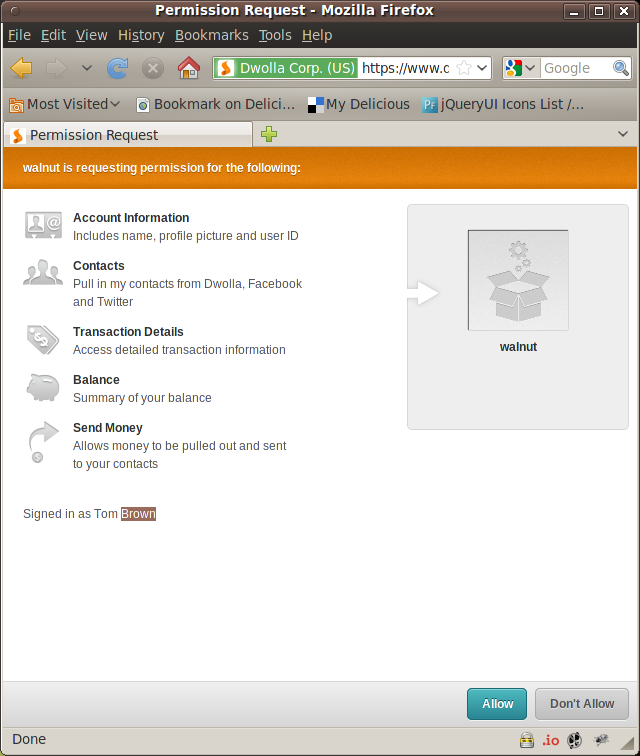

!SLIDE
# Dwolla OAuth API

!SLIDE bullets
# Dwolla API
* [Get a Token](https://www.dwolla.com/developers/authentication)
* [Use a Token](https://www.dwolla.com/developers/endpoints/accountapi/send)

!SLIDE center

!SLIDE commandline incremental
# Make a payment #

    $ export DWOLLA_OAUTH2_TOKEN=abcdefghijklmnopqrstuvwxyz
    $ export DWOLLA_PIN=1234
    $ irb
    $> load "dwolla_pay.rb"
    $> r = Dwolla.new.send('herestomwiththeweather@gmail.com',1)
    $> txn_id = JSON.parse(r.body)['SendResult']

!SLIDE bullets incremental
# Some OAuth 1 Milestones
* April 15, 2009: Sign-in with Twitter
* June 24, 2009: OAuth Core 1.0 Revision A
* April 2010: IETF publishes [RFC 5849](http://tools.ietf.org/html/rfc5849)

!SLIDE
# OAuth 2

!SLIDE bullets incremental
# 2 Mantras
* OAuth 1 is too difficult for developer community (Facebook)
* No need to make it more secure than session cookie 

!SLIDE bullets incremental 
# Refuting Mantra #1
* Twitter

!SLIDE bullets incremental 
# Refuting Mantra #2
* Steal bearer token after session

!SLIDE center
# Game On!

