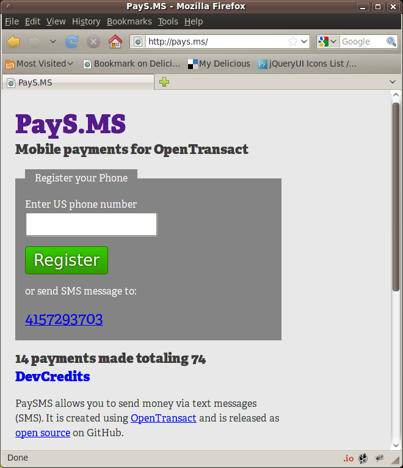
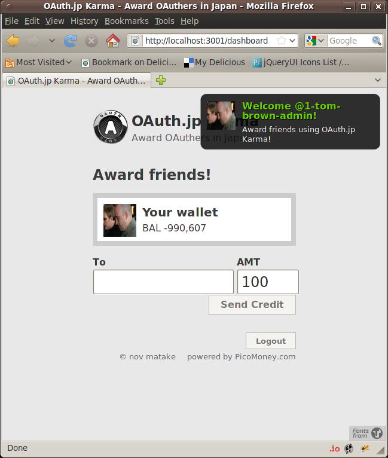
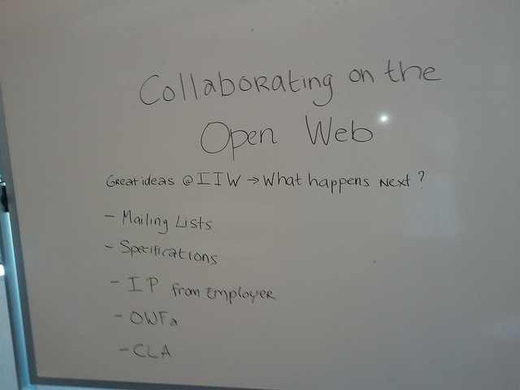

!SLIDE center
## Open Transact

## Mailing Lists
* [Agile Banking](https://groups.google.com/forum/#!forum/agile-banking)
* [OpenTransact](https://groups.google.com/forum/#!forum/opentransact)

!SLIDE bullets incremental
# Asset class
* usd
* frequent flyer miles
* bitcoins
* hours

!SLIDE bullets incremental
# Transaction URL
* http://FSP.com/transactions/usd
* http://FSP.com/transactions/miles
* http://FSP.com/transactions/bitcoins
* http://FSP.com/transactions/hours

!SLIDE
#List transactions#

	GET /transactions/usd

!SLIDE 
#Create a transaction#

	POST /transactions/usd
	Host: FSP.com

	to=bill@recipient.com&
	amount=10&
	memo=consulting

!SLIDE bullets incremental
#opentransact-ruby
* [opentransact-ruby gem](https://github.com/opentransact/opentransact-ruby)
* [paysms (Sinatra)](https://github.com/opentransact/paysms)
* [OAuth.jp Karma (Rails)](https://github.com/nov/oauth.jp-karma)

!SLIDE center

!SLIDE center

!SLIDE center
#Open Web Foundation CLA

